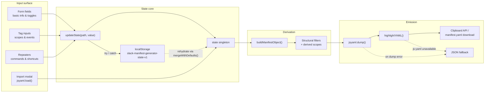
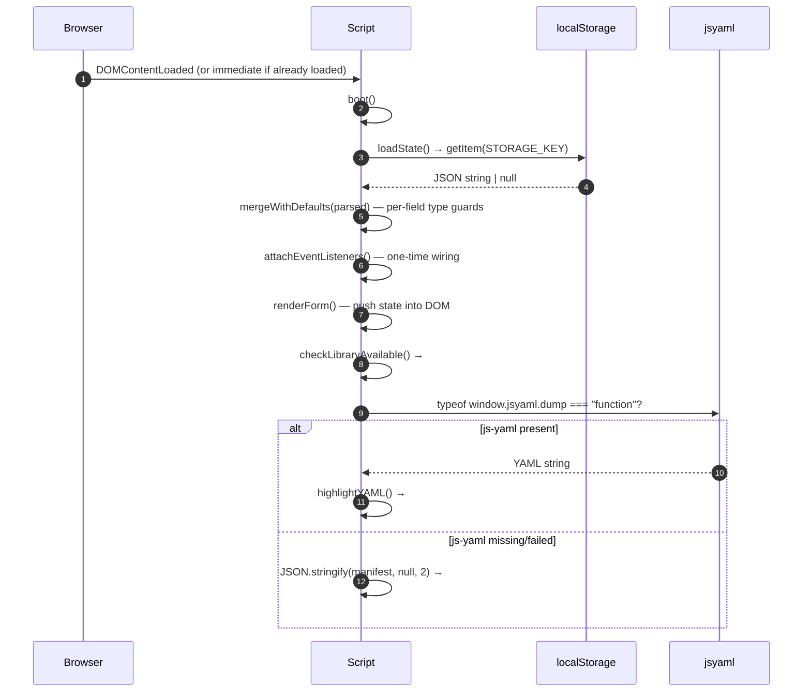
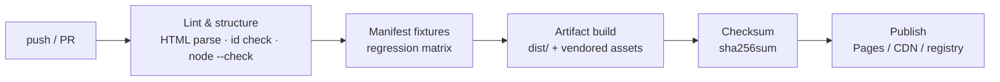

# Slack App Manifest Generator

**Build a schema-compliant Slack app manifest — live, offline, and entirely in your browser.**

A single-file, zero-build, zero-backend tool that turns a guided form (app metadata, OAuth scopes, slash commands, event subscriptions, shortcuts, interactivity) into a validated, syntax-highlighted `manifest.yaml` in real time — plus round-trip import of existing manifests and durable workspace persistence.

[](LICENSE)
[](#prerequisites)
[](#prerequisites)
[](#runtime-dependencies)
[](#manifest-schema-coverage)
[](#manual-regression-matrix)
[](#static-analysis--smoke-checks)
[](#contributing)

> [!NOTE]
> **Positioning.** The upstream brief for this document was "a README for a logging library"; the artifact in this repository is the opposite end of the observability pipeline — a **manifest generator** that produces the declarative configuration of a Slack app. The two converge in practice: the generated `manifest.yaml` is the versioned, reviewable source of truth you commit next to your chat-ops and log-delivery code, so incident tooling, alert routing, and Slack app capabilities can never drift apart. Everything documented below is derived strictly from the shipped source code.

---

## Table of Contents

- [Slack App Manifest Generator](#slack-app-manifest-generator)
  - [Table of Contents](#table-of-contents)
  - [Features](#features)
  - [Tech Stack & Architecture](#tech-stack--architecture)
    - [Core Technologies](#core-technologies)
    - [Runtime Dependencies](#runtime-dependencies)
    - [Project Structure](#project-structure)
    - [Key Design Decisions](#key-design-decisions)
    - [Manifest Generation Pipeline](#manifest-generation-pipeline)
    - [Architectural Deep Dive](#architectural-deep-dive)
  - [Getting Started](#getting-started)
    - [Prerequisites](#prerequisites)
    - [Installation](#installation)
    - [Quick Start](#quick-start)
  - [Testing](#testing)
    - [Static Analysis & Smoke Checks](#static-analysis--smoke-checks)
    - [Manual Regression Matrix](#manual-regression-matrix)
  - [Deployment](#deployment)
    - [Deployment Models](#deployment-models)
    - [Build Step](#build-step)
    - [Containerization (Docker Compose + nginx)](#containerization-docker-compose--nginx)
    - [CI/CD Pipeline Integration](#cicd-pipeline-integration)
  - [Usage](#usage)
    - [Basic Usage](#basic-usage)
    - [Manifest Schema Coverage](#manifest-schema-coverage)
    - [Advanced Usage](#advanced-usage)
    - [Custom Formatters](#custom-formatters)
    - [Edge Cases & Failure Modes](#edge-cases--failure-modes)
    - [Programmatic / Console Integration](#programmatic--console-integration)
  - [Configuration](#configuration)
    - [Workspace State (`localStorage`)](#workspace-state-localstorage)
    - [Compile-Time Constants](#compile-time-constants)
    - [Hosting & Environment Configuration](#hosting--environment-configuration)
    - [Full State Schema](#full-state-schema)
  - [License](#license)
  - [Support the Project](#support-the-project)

---

## Features

**Authoring & form UX**

- **Seven-section guided form** mapping 1:1 onto the Slack manifest schema: Basic Information (name, short/long description, background color), Features & Settings (6 toggles), OAuth Scopes, Slash Commands, Event Subscriptions, Shortcuts, and Interactivity — plus an eighth sticky card holding the live *Generated YAML* preview.
- **Real-time YAML output** rendered on every keystroke — no "Generate" button, no submit round-trip, no page reloads.
- **Live character counters** on `appName` (35-char Slack limit) and `shortDescription` (140-char Slack limit), enforced both by `maxlength` and by the visible `n / limit` counter.
- **Synchronised color input** — a native `<input type="color">` picker and a free-text hex field stay in lockstep; the picker normalises to upper-case hex, and valid hex typed into the text field is pushed back into the picker.
- **Dynamic repeaters** for slash commands and shortcuts with per-row **Add** / **Remove** controls and stable `data-*` field binding.
- **Pill/tag input widgets** for bot scopes, user scopes, bot events, and user events, with **duplicate suppression** and keyboard-first entry (`Enter` commits the value).
- **Unified toggle component** with an animated switch, `aria-pressed` state, and data-driven definitions (`TOGGLE_DEFS`) so new flags render uniformly with a label and help text.

**Validation & guard-rails**

- **Non-blocking validation** — errors are surfaced inline on `blur` and never prevent YAML generation, so users are never locked out of their own work.
- **Format assertions**: hex color (`/^#([0-9a-fA-F]{6})$/`), HTTPS request URLs (`/^https:\/\/[^\s]+$/i`), slash-command prefix (`/`-prefixed), and callback ID charset (`/^[A-Za-z0-9_]+$/`).
- **Required-field guards** for app name, command description, and shortcut `name` / `callbackId` / `description`.
- **Structural filters before serialization** — incomplete slash commands (`command` + `description` missing) and incomplete shortcuts (`name` + `callbackId` + `description` missing) are silently dropped instead of emitting schema-invalid YAML. Placeholder rows are never written to disk.

**Output, export & interop**

- **`js-yaml`-serialized YAML** with deterministic dump options (`noRefs: true`, `lineWidth: 120`, `quotingType: '"'`, `forceQuotes: false`).
- **Dependency-free regex YAML highlighter** colouring keys, strings, booleans/numbers, `null`, list dashes, and comments — with correct `#`-in-string disambiguation.
- **Clipboard export** via the async Clipboard API with a hidden-`<textarea>` + `document.execCommand("copy")` fallback for non-secure contexts, plus a transient "Copied" badge.
- **File export** as `manifest.yaml` (`application/x-yaml;charset=utf-8`) through `Blob` + object-URL with automatic revocation.
- **Round-trip YAML import** — paste an existing manifest into a modal and the whole form is repopulated, including re-derivation of the `incomingWebhooks` toggle from an `incoming-webhook` bot scope.
- **JSON fallback path** — if `js-yaml` fails to load, output degrades to pretty-printed JSON with an explanatory banner instead of a blank panel.

**State, persistence & resilience**

- **Debounced rendering** (`DEBOUNCE_MS = 80`) on text inputs to keep typing at 60 fps while toggles, selects, and list mutations render synchronously.
- **`localStorage` persistence** under the versioned key `slack-manifest-generator-state-v1`, written on every state mutation.
- **Forward-compatible rehydration** — `mergeWithDefaults()` reconstructs state field-by-field, so a partial, stale, or hand-edited persisted payload cannot crash the app or poison the form with wrong-typed values.
- **Graceful degradation everywhere** — persistence, clipboard, and YAML serialization are each individually wrapped with `try` / `catch`; private-mode or quota-exceeded storage is silently tolerated.
- **Reset-to-defaults** with a confirmation prompt that clears persisted state and restores the pristine baseline.
- **XSS-safe rendering** — every user-supplied value interpolated into a markup template passes through `escapeHTML()` before DOM insertion; field values are assigned through `.value` (never parsed as markup). Audited by the [interpolation check](#static-analysis--smoke-checks).
- **Zero infrastructure** — no build step, no bundler, no backend, no telemetry, no network calls other than two CDN scripts. The generated manifest never leaves the client.

---

## Tech Stack & Architecture

### Core Technologies

| Layer | Technology | Role in the project |
| :--- | :--- | :--- |
| Markup | HTML5 (single document, `index.html`, 1,567 lines) | Entire application shell — form, output panel, import modal |
| Styling | Tailwind CSS via the Play CDN (`https://cdn.tailwindcss.com`) | Utility classes for layout (`max-w-7xl`, `grid`, `lg:grid-cols-2`, `space-y-*`) and state variants |
| Styling (custom) | Hand-written CSS in a single `<style>` block | Design tokens (`:root { color-scheme: dark }`), `.section-card`, `.field-*`, `.btn-*`, `.tag-pill`, `.toggle`, `.output-pre`, YAML token colours, custom scrollbars, sticky output column |
| Serialization | js-yaml 4.1.0 (cdnjs, SRI-pinned) | `jsyaml.dump()` for generation and `jsyaml.load()` for import |
| Application logic | Vanilla JavaScript (ES2015+), `"use strict"`, single inline `<script>` | State container, manifest builder, validation, DOM rendering, persistence, export |
| Icons | Inline SVG (24×24, `stroke="currentColor"`) | Import, Reset, Copy, and Download glyphs — no icon font or sprite dependency |
| Persistence | Web Storage API (`localStorage`) | Versioned workspace snapshot |
| Export | Blob / object URL, async Clipboard API | `manifest.yaml` download and copy-to-clipboard |
| Build tooling | **None** | The repository ships exactly two tracked files; nothing is compiled or transpiled |

**Design language:** deep dark theme (`#0b0d12` background, `#11141b` surfaces, `#1f2330`/`#2a2f3a` borders) with an indigo accent (`#4f46e5`) for primary actions and a red accent (`#dc2626`/`#f87171`) for destructive or invalid states. Font stacks are system-native (`ui-sans-serif`, `ui-monospace`).

### Runtime Dependencies

Both dependencies are loaded from public CDNs at runtime — **there is no `package.json`, lockfile, or `node_modules/`**.

| Dependency | Version | Delivery | Integrity |
| :--- | :--- | :--- | :--- |
| Tailwind CSS | Play CDN (floating) | `<script src="https://cdn.tailwindcss.com">` | Not pinned |
| js-yaml | 4.1.0 | `https://cdnjs.cloudflare.com/ajax/libs/js-yaml/4.1.0/js-yaml.min.js` | Subresource Integrity hash `sha512-CSBhVREy…WfWg==` with `crossorigin="anonymous"` and `referrerpolicy="no-referrer"` |

> [!IMPORTANT]
> Tailwind's Play CDN is a **development-oriented** distribution that compiles utilities in the browser at load time. It is ideal for a zero-build tool like this one, but for locked-down or offline deployments you should replace it with a precompiled Tailwind stylesheet and self-host `js-yaml` (see [Offline / air-gapped deployment](#offline--air-gapped-deployment)).

### Project Structure

The repository surface is intentionally minimal: one application file, one license, one document. The tree below is annotated with the internal landmarks you need in order to navigate `index.html` as if it were a multi-file project.

<details>
<summary><strong>Annotated project structure (full tree)</strong></summary>

```text
slack-app-manifest-generator/
├── .git/
│   ├── HEAD
│   ├── config
│   └── …                          # Git metadata (remote: OstinUA/slack-app-manifest-generator)
├── LICENSE                        # Apache License 2.0, January 2004 (11,357 bytes)
├── index.html                     # ⚙️ The entire application (1,567 lines)
│   ├── <head>
│   │   ├── <meta charset>         # UTF-8 encoding
│   │   ├── <meta viewport>        # width=device-width, initial-scale=1.0
│   │   ├── <title>                # "Slack App Manifest Generator"
│   │   ├── <script> tailwindcss   # Tailwind Play CDN
│   │   ├── <script> js-yaml@4.1.0 # SRI-pinned YAML engine
│   │   └── <style>                # ≈250 lines: tokens, components, YAML theme
│   ├── <body>
│   │   ├── <header>               # Title, subtitle, "Import YAML" + "Reset to Defaults"
│   │   ├── #library-warning       # Banner shown when js-yaml is unavailable
│   │   └── <main>                 # Two-column responsive grid
│   │       ├── #form-column       # LEFT: authoring surface
│   │       │   ├── Basic Information      → App Name, Short/Long Description, Background Color
│   │       │   ├── Features & Settings    → #toggles-container (6 toggles)
│   │       │   ├── OAuth Scopes           → #bot-scopes-tags, #user-scopes-tags
│   │       │   ├── Slash Commands         → #commands-container (repeater)
│   │       │   ├── Event Subscriptions    → #input-event-url, #bot-events-tags, #user-events-tags
│   │       │   ├── Shortcuts              → #shortcuts-container (repeater)
│   │       │   └── Interactivity          → #interactivity-container
│   │       └── .output-sticky     # RIGHT: sticky preview
│   │           ├── #output-error  # Dump-error banner (hidden by default)
│   │           └── #output-code   # Highlighted YAML / JSON fallback
│   ├── #import-modal              # Paste-and-import dialog (role="dialog", aria-modal="true")
│   └── <script>                   # ≈1,100 lines: the application itself
│       ├── CONSTANTS              # STRINGS, STORAGE_KEY, DEBOUNCE_MS, regexes, TOGGLE_DEFS
│       ├── STATE                  # `state` singleton + `initState()`
│       ├── PERSISTENCE            # saveState / loadState / mergeWithDefaults / normalizers
│       ├── STATE UPDATE           # updateState(path, value, { debounce })
│       ├── MANIFEST BUILDER       # buildManifestObject()
│       ├── YAML RENDER            # renderYAML() + highlightYAML()
│       ├── RENDER FORM            # renderForm, renderToggles, renderTags, repeaters
│       ├── VALIDATION HELPERS     # validateField(name) + per-field blur handlers
│       ├── EVENT WIRING           # attachEventListeners()
│       ├── COPY / DOWNLOAD / IMPORT
│       ├── UTILITIES              # escapeHTML()
│       └── STARTUP                # checkLibraryAvailable() + boot()
└── README.md                      # This document
```

**Line-number index of the script's section banners** (handy for reviewers and contributors):

| Section | Line |
| :--- | ---: |
| `CONSTANTS` | 467 |
| `STATE` | 507 |
| `PERSISTENCE` | 551 |
| `STATE UPDATE` | 619 |
| `MANIFEST BUILDER` | 649 |
| `YAML RENDER` | 758 |
| `RENDER FORM` | 845 |
| `VALIDATION HELPERS` | 1227 |
| `EVENT WIRING` | 1277 |
| `COPY / DOWNLOAD / IMPORT` | 1375 |
| `UTILITIES` | 1533 |
| `STARTUP` | 1540 |

</details>

### Key Design Decisions

| # | Decision | Rationale | Consequence / trade-off |
| :-: | :--- | :--- | :--- |
| 1 | **Single-file application** | Maximises portability: open `index.html`, deploy to any static host, attach to a PR as an artifact, or email it. No toolchain drift, no dependency CVEs beyond the two CDN scripts. | Contributors edit one long file; reviewers navigate by the section banners and line index. |
| 2 | **No build step** | The artifact served is the artifact committed. `git clone` → open → done, with zero minute-one friction. | Tailwind's Play CDN compiles utilities client-side; production-grade caching and purging require opting into a precompiled stylesheet. |
| 3 | **State as the single source of truth** | `state` is a plain object; every read/write flows through `updateState(path, value)`, which persists to `localStorage` and re-renders. There is no DOM-as-database pattern. | One predictable mutation funnel makes persistence and rendering impossible to forget — but DOM nodes are not diffed, so list editors re-render their container wholesale. |
| 4 | **Builder instead of template** | `buildManifestObject()` composes the manifest imperatively and **omits** absent keys rather than emitting `null`/`""` placeholders. | Output matches what Slack's editor produces; filtering happens at a single, testable seam. |
| 5 | **Derived, not duplicated, scope state** | The `incomingWebhooks` toggle implies the `incoming-webhook` scope. `buildManifestObject()` unions it in at serialization time; the UI keeps the user's explicit list untouched. | Toggling the feature on and off never destroys a hand-typed scope list, and the emitted manifest stays consistent. |
| 6 | **Validation is advisory** | Field errors render on `blur`; serialization proceeds regardless. | Users iterating on a half-finished manifest still get usable output; invalid entries are filtered at generation time instead of throwing. |
| 7 | **Defensive deserialization** | `mergeWithDefaults()` type-checks every field, and `normalizeCommand()` / `normalizeShortcut()` coerce list entries. | Stale payloads from an older schema load cleanly; the versioned `STORAGE_KEY` gives a hard reset escape hatch when the shape changes. |
| 8 | **Layered graceful degradation** | Three independent fallbacks: JSON output when `js-yaml` is missing, `execCommand` copy when the Clipboard API is unavailable, silent no-op when `localStorage` throws. | The tool remains functional in private windows, non-secure contexts, and air-gapped mirrors (with vendored assets). |
| 9 | **Escape-on-insert** | `escapeHTML()` wraps every interpolated user value; the YAML highlighter escapes before injecting markup. | No persisted-XSS vector from imported manifests or typed scope names. |
| 10 | **Debounce by input class** | Text-like inputs debounce at 80 ms; toggles, selects, checkbox changes, and add/remove actions render synchronously. | Typing stays smooth on long documents without introducing perceptible lag on discrete actions. |

### Manifest Generation Pipeline



### Architectural Deep Dive

<details>
<summary><strong>Boot lifecycle, debounce semantics, and the derived-state model</strong></summary>

#### 1. Boot sequence



`boot()` is registered on `DOMContentLoaded` only when `document.readyState === "loading"`; otherwise it runs immediately, which makes the script safe to inject after parse (e.g. from a console or a test harness).

#### 2. Debounce semantics

- Text-like inputs (`appName`, `shortDescription`, `longDescription`, hex color, request URLs, repeater text fields) call `updateState(..., { debounce: true })`.
- `renderDebounce` holds a single timer handle; each keystroke clears and re-arms it with an 80 ms delay, so `renderYAML()` executes once per typing pause.
- **Persistence is never debounced** — `saveState()` runs on the leading edge of every mutation, so a tab closed mid-typing still retains the last character.
- Discrete actions (toggle flips, select changes, pill add/remove, shortcut/command add/remove) call `updateState()` without the flag and therefore render synchronously.

#### 3. Derived-state model

The generator distinguishes three kinds of data:

| Kind | Example | Storage behaviour | Emission behaviour |
| :--- | :--- | :--- | :--- |
| **Authored** | `appName`, `botScopes`, `slashCommands` | Persisted verbatim | Emitted when non-empty |
| **Derived** | `incoming-webhook` bot scope, `socket_mode_enabled` | Never persisted (except via its own toggle) | Recomputed on every render from toggles |
| **Constant** | `_metadata.major_version = 1`, `minor_version = 1` | Never persisted | Always emitted |

Because derived values are recomputed rather than stored, the manifest can never describe a state that the toggles contradict.

#### 4. Rehydration contract

`mergeWithDefaults(persisted)` builds a **fresh** `initState()` and then copies only well-typed values from the persisted payload:

- Strings: copied via `typeof === "string"` guards (invalid types fall back to `""`).
- Booleans: coerced with `Boolean(...)` for short-circuit keys, `Object.assign` for the `toggles` and `interactivity` maps.
- Arrays: validated with `Array.isArray()`, then cloned via `.slice()`; list entries are normalised field-by-field with `normalizeCommand()` / `normalizeShortcut()`.
- Unknown keys: ignored entirely — forward compatibility without schema migrations.

Net effect: a truncated or partially corrupted snapshot degrades to defaults per field, never to a crashed application.

</details>

---

## Getting Started

### Prerequisites

| Requirement | Minimum | Notes |
| :--- | :--- | :--- |
| Web browser | Any modern evergreen browser (Chrome, Edge, Firefox, Safari) with ES2015+ support | Required features: `Object.assign`, template literals, arrow functions, `Array.from`, `Set`, `URL.createObjectURL`, `Blob`, CSS custom properties |
| Network access | HTTPS egress to `cdn.tailwindcss.com` and `cdnjs.cloudflare.com` | Only for the two runtime assets; see [Offline deployment](#offline--air-gapped-deployment) to remove this requirement |
| Git | Any version | Only to clone the repository — the app itself needs no tooling |
| Node.js / Docker / Python | **Not required** | Optional: Node.js ≥ 18 (or Python ≥ 3.8) to serve the file over HTTP, Docker ≥ 24 for container deploys, Node.js/`npm` only if you choose to contribute a build pipeline |
| `jq` | Optional (`≥ 1.6`) | Used by the optional structural smoke test in [Testing](#testing) |

> [!TIP]
> Because the entire application is client-side, there is no server, no database, and no credentials to manage. The manifest you generate is never transmitted anywhere — a useful property when the app under construction will itself handle production incident data.

### Installation

```bash
# 1. Clone the repository
git clone https://github.com/OstinUA/slack-app-manifest-generator.git

# 2. Enter the project directory
cd slack-app-manifest-generator

# 3. Verify the two tracked artifacts are present
ls -la
# LICENSE   README.md   index.html

# 4. Launch — pick one of the options below
```

**Option A — open the file directly (fastest):**

```bash
# macOS
open index.html

# Linux
xdg-open index.html

# Windows (PowerShell)
Start-Process index.html
```

**Option B — serve over HTTP (recommended; enables clipboard permissions and avoids some `file://` restrictions):**

```bash
# Python 3 (preinstalled on most Unix systems)
python3 -m http.server 8000 --bind 0.0.0.0
# → http://localhost:8000

# Node.js, no install required
npx --yes serve . -l 8000
# → http://localhost:8000

# If the package manager is available
npm i -g http-server && http-server -p 8000 -a 0.0.0.0
# → http://localhost:8000
```

Then open `http://localhost:8000` in your browser. That's the whole install: **there is nothing to compile, no dependencies to fetch, and no environment file to create.**

<details>
<summary><strong>Alternative installation methods, build-from-source notes, and troubleshooting</strong></summary>

#### `file://` vs. HTTP: what actually differs

| Capability | `file://` | `http(s)://` |
| :--- | :--- | :--- |
| Form editing, YAML generation, highlighting | ✅ | ✅ |
| `localStorage` persistence | ✅ (per-file origin) | ✅ (per-host origin) |
| Download as `manifest.yaml` | ✅ | ✅ |
| Async Clipboard API (`navigator.clipboard`) | ⚠️ Often blocked | ✅ (HTTPS or `localhost`) |
| `execCommand("copy")` fallback | ✅ (still available in current browsers) | ✅ |

The copy button implements both paths, so `file://` usage degrades to the legacy fallback automatically rather than failing.

#### Staging a directory that may be opened from disk

```bash
# Stage only the artifacts you want to ship
mkdir -p dist
cp index.html LICENSE dist/

# Optional: pin the config that triggers the browser to revalidate after deploys
cat > dist/netlify.toml <<'TOML'
[build]
  publish = "."
TOML
```

#### Offline / air-gapped deployment

The only external requirements are the two CDN scripts. To make the tool fully self-contained, vendor them and bind locally:

```bash
mkdir -p vendor
curl -fsSL -o vendor/js-yaml.min.js \
  https://cdnjs.cloudflare.com/ajax/libs/js-yaml/4.1.0/js-yaml.min.js

# Optional: a precompiled Tailwind stylesheet instead of the Play CDN.
# Requires a one-time toolchain; the output is static CSS.
npx --yes tailwindcss@3 -i ./src/input.css -o vendor/tailwind.css --minify

# Verify the SRI hash you obtained matches the one hard-coded in index.html
openssl dgst -sha512 -binary vendor/js-yaml.min.js | openssl base64 -A
# expected (v4.1.0):
# CSBhVREyzHAjAFfBlIBakjOf8GRTGW/QFt/0/v1/n0/v3vO1jrkXlJqjjQ5fXIoXSU8z1jxiU9MaC7K7XSWfWg==
```

Then replace the two `<script src="https://...">` tags in `index.html` with local paths:

```html
<!-- Before (CDN) -->
<link rel="stylesheet" href="/vendor/tailwind.css" />
<script src="vendor/js-yaml.min.js"></script>

<!-- After swapping in vendored assets, drop the integrity/crossorigin
     attributes — SRI applies to fetched subresources, not same-origin files. -->
```

> [!WARNING]
> If you keep the `integrity` and `crossorigin="anonymous"` attributes on a same-origin file, some configurations will refuse the script. Remove both attributes when self-hosting, and instead enforce integrity at the web-server layer (for example an `expires`/`immutable` cache policy plus a checksummed deployment artifact).

#### "Building from source"

There is no compiler in this project — `index.html` **is** the source and **is** the distributable. "Building" therefore means one of:

1. **Vendoring** the CDN assets (above) to produce a sealed, network-independent bundle.
2. **Minifying** the inline script and stylesheet for a smaller payload:
   ```bash
   npx --yes html-minifier-terser \
     --collapse-whitespace --remove-comments --minify-css true --minify-js true \
     -o dist/index.html index.html
   ```
3. **Checksumming** for release verification:
   ```bash
   sha256sum index.html > index.html.sha256
   ```

#### Troubleshooting

| Symptom | Cause | Resolution |
| :--- | :--- | :--- |
| Red banner: *"The js-yaml library failed to load…"* | The cdnjs request was blocked (offline network, corporate proxy, ad-blocker, CSP). | The output panel automatically shows JSON instead of YAML; no work is lost. Allow `cdnjs.cloudflare.com` or switch to the vendored setup above. |
| Output panel shows JSON, not YAML | Same root cause as above, or a `jsyaml.dump` exception (message appears in the banner above the panel). | Restore the library, or continue editing — the form state is unaffected and will re-serialize on the next successful render. |
| "Copy to Clipboard" appears to do nothing | Clipboard permission denied, or the page is served from a non-secure origin. | The code falls back to `execCommand("copy")`; if the browser blocks that too, use **Download manifest.yaml** and copy from the file. The "Copied" badge only appears when the write resolves. |
| Inputs are empty after a reload | `localStorage` is unavailable (private/incognito window, storage disabled, or quota exceeded). | Persistence failures are swallowed by design. Use **Download manifest.yaml** as your durable artifact, or run outside private mode. |
| Text inputs look unstyled | Tailwind's Play CDN was blocked while custom CSS loaded. | Layout degrades only partially (custom component CSS still applies); allow `cdn.tailwindcss.com` or vendor a precompiled stylesheet. |
| Old fields appear in the form after an upgrade | A snapshot under an older `STORAGE_KEY` schema was loaded and merged field-by-field. | Click **Reset to Defaults** (confirmation required) to clear storage and rebuild the baseline. |
| "Import" reports *"The document is not a valid Slack manifest object."* | `jsyaml.load()` returned `null` or a non-object (e.g. a bare scalar or a list). | Paste the full manifest document, starting at `_metadata:` or `display_information:`. |

</details>

### Quick Start

1. Open the application (`index.html` or `http://localhost:8000`).
2. Fill in **Basic Information** — *App Name* is required (max 35 chars); the counter turns live as you type.
3. Flip the toggles you need under **Features & Settings**; each one reshapes the emitted `settings:` and `features:` blocks.
4. Add **Bot Token Scopes** (pre-seeded with `commands` and `chat:write`) by typing a scope and pressing `Enter`.
5. Add a **Slash Command**, **Event Subscription**, or **Shortcut** as required.
6. Watch the sticky **Generated YAML** panel on the right — it updates as you type.
7. Click **Copy to Clipboard** or **Download manifest.yaml**.
8. In Slack, go to *Your Apps → Create New App → From a manifest*, choose your workspace, and paste the YAML.

---

## Testing

There is **no automated test framework in this repository** — no `package.json`, no `jest`/`vitest`/`playwright` config, no CI workflow file. The application is a single static document with no module boundaries to unit-test in place. The commands below are the **verification procedures that actually work against this codebase** today: structural checks you can run in any shell, and browser-console assertions against the live application.

### Static Analysis & Smoke Checks

```bash
# ── 1. Repository integrity ───────────────────────────────────────────────────
git status --porcelain          # expect: nothing but files you have not committed yet
test -f index.html && test -f LICENSE && echo "artifacts present"

# ── 2. Tag balance (dependency-free HTML structure check) ─────────────────────
# NOTE: do NOT use an XML parser here. The document is deliberately not
# XML-well-formed: raw &, &&, < and > characters appear inside the inline
# <script> and <style> blocks. A stack-based HTML parse is the correct check.
python3 - <<'PY'
from html.parser import HTMLParser

VOID = {"area","base","br","col","embed","hr","img","input","link","meta",
        "param","source","track","wbr"}

class Balance(HTMLParser):
    def __init__(self):
        super().__init__(convert_charrefs=True)
        self.stack, self.errors = [], []
    def handle_starttag(self, tag, attrs):
        if tag not in VOID:
            self.stack.append((tag, self.getpos()))
    def handle_endtag(self, tag):
        if tag in VOID:
            return
        if not self.stack:
            self.errors.append(f"stray </{tag}> at line {self.getpos()[0]}")
        elif self.stack[-1][0] != tag:
            top, pos = self.stack.pop()
            self.errors.append(f"</{tag}> closes <{top}> opened at line {pos[0]}")
        else:
            self.stack.pop()

p = Balance()
p.feed(open("index.html", encoding="utf-8").read())
p.close()
for tag, pos in p.stack:
    p.errors.append(f"unclosed <{tag}> opened at line {pos[0]}")
print("index.html:", "tag balance OK" if not p.errors else p.errors)
raise SystemExit(1 if p.errors else 0)
PY

# ── 3. Structural invariants ──────────────────────────────────────────────────
grep -c 'id="output-code"' index.html            # expect: 1
grep -c 'id="import-modal"' index.html           # expect: 1
grep -o 'STORAGE_KEY.*' index.html               # expect: 4 hits — first is the v1 key literal

# Every getElementById(...) target must exist as an id="..." in the markup.
python3 - <<'PY'
import re, sys
html = open("index.html", encoding="utf-8").read()
declared = set(re.findall(r'id="([^"]+)"', html))
referenced = set(re.findall(r'getElementById\("([^"]+)"\)', html))
missing = sorted(referenced - declared)
print("referenced ids:", len(referenced), "| undeclared:", missing)
sys.exit(1 if missing else 0)
PY

# ── 4. JavaScript syntax check (extract the inline <script> and parse it) ─────
python3 - <<'PY' > /tmp/app.js
import re
html = open("index.html", encoding="utf-8").read()
body = re.findall(r"<script>(.*?)</script>", html, re.S)
print(max(body, key=len))
PY
node --check /tmp/app.js && echo "inline script: syntax OK"

# ── 5. XSS audit — classify every ${...} interpolation in HTML templates ──────
# Every interpolation must either be escapeHTML(...)-wrapped, or reference only
# structural values (numeric indices, frozen TOGGLE_DEFS keys, booleans).
python3 - <<'PY'
import re, sys

SRC = open("index.html", encoding="utf-8").read()
ALLOWED = {"idx", "def.key", "state.toggles[def.key]", "state.interactivity.enabled"}
STR_LIT = re.compile(r'"(?:[^"\\]|\\.)*"')
PATH_RE = re.compile(r"[A-Za-z_$][\w$]*(?:\.[\w$]+|\[[^\]]+\])*")

escaped, structural, review = [], [], []
for lineno, line in enumerate(SRC.splitlines(), 1):
    for expr in re.findall(r"\$\{([^{}]*)\}", line):
        e = expr.strip()
        if e.startswith("escapeHTML("):
            escaped.append((lineno, e))
            continue
        bare = STR_LIT.sub('""', e)                  # drop string literals, keep identifiers
        paths = set(PATH_RE.findall(bare)) - {"true", "false", "null"}
        if paths and paths <= ALLOWED:
            structural.append((lineno, e))
        else:
            review.append((lineno, e, sorted(paths)))

print(f"escaped user data : {len(escaped)}")
print(f"structural (safe) : {len(structural)}")
for lineno, e, paths in review:
    print(f"REVIEW line {lineno}: ${{{e}}} -> {paths}")
print("interpolation audit:", "OK" if not review else f"{len(review)} site(s) need review")
sys.exit(1 if review else 0)
PY
# Current baseline: 4 escaped interpolations, 18 structural, 0 needing review.

# ── 6. Lint the inline script (ESLint, no config file required) ───────────────
npx --yes eslint@8 --no-eslintrc \
  --env browser,es2021 --parser-options ecmaVersion:2021 \
  --rule '{"no-unused-vars":"warn","no-undef":"error"}' /tmp/app.js

# ── 7. HTML validation (optional; downloads its tooling on demand) ────────────
# The document uses XHTML-style self-closing void elements (<meta … />, <input … />),
# so html-validate's default "void-style: omit" rule reports 11 findings. Pin the
# intended style once in a config file and the check runs clean:
cat > .htmlvalidate.json <<'JSON'
{
  "extends": ["html-validate:recommended"],
  "rules": {
    "void-style": ["error", { "style": "selfclosing" }],
    "no-inline-style": "off",
    "long-title": "off"
  }
}
JSON
npx --yes html-validate index.html        # → exits 0 on a clean tree

# ── 8. Manifest-shaped assertions with jq (see the console recipe in Usage) ───
# Applies to a manifest.json exported via the JSON formatter recipe.
```

> [!NOTE]
> Checks 1–5 run **fully offline** and require nothing beyond `git`, `python3` (standard library), and — for step 4 — a Node.js binary used purely as a syntax checker. Steps 6–7 fetch their tooling from the npm registry on demand; skip them in air-gapped environments.

> [!WARNING]
> Do **not** validate `index.html` with an XML parser (`xmllint`, `xml.dom.minidom`, `ElementTree`). The document uses XHTML-style self-closing void tags, but the inline `<script>` and `<style>` blocks contain raw `&`, `&&`, `<`, and `>` characters; any XML parser rejects it at the first such occurrence. Use the stack-based HTML check in step 2 instead.

### Manual Regression Matrix

The following behaviours are the ones most likely to regress during edits. Walk the table after any change to `buildManifestObject()`, the repeaters, or the import path.

| # | Scenario | Steps | Expected result |
| :-: | :--- | :--- | :--- |
| 1 | Required-field validation | Type nothing in *App Name*, then blur the field | Red border + "This field is required."; YAML still regenerates with an empty `name` |
| 2 | Hex validation | Enter `#ZZZZZZ` in the hex field, blur | Red border + "Must be a valid hex color, e.g. #2C2D30."; manifest keeps `#2C2D30` |
| 3 | Color sync | Pick a colour, read the hex field | Hex field updates upper-case; typing valid hex syncs the picker |
| 4 | Derived webhook scope | Enable *Incoming Webhooks* | `oauth_config.scopes.bot` gains `incoming-webhook` and `features.incoming_webhooks: true`; disable → both revert, explicit list intact |
| 5 | Incomplete command filtering | Add a command, leave description empty | No `features.slash_commands` entry emitted; row stays in the form |
| 6 | Duplicate suppression | Add `chat:write` twice | Second entry is discarded, input clears, single pill remains |
| 7 | Not-a-slash command | Type `weather` in the command field, blur | "Command must start with "/"." |
| 8 | Callback ID charset | Type `Open-Dialog` in a shortcut's Callback ID, blur | "Callback ID must contain only letters, numbers, and underscores." |
| 9 | Non-HTTPS URL | Enter `http://example.com/events`, blur | "URL must start with https:// and be valid."; `settings.event_subscriptions` omits `request_url` |
| 10 | Settings always present | Empty the entire form | `settings` still emits `org_deploy_enabled`, `socket_mode_enabled`, `token_rotation_enabled` as `false` |
| 11 | Round-trip fidelity | Download the YAML → Reset to Defaults → Import the file | Form is repopulated; re-generated YAML is semantically identical |
| 12 | Persistence | Edit fields → hard-reload the tab | State survives; counters rehydrate to the correct lengths |
| 13 | Debounce behaviour | Hold a key down in *App Name* | Output updates in one repaint per pause; no visible lag or dropped keystrokes |
| 14 | Degraded YAML engine | Block `cdnjs.cloudflare.com` and reload | Warning banner renders; panel shows pretty-printed JSON; form remains fully usable |
| 15 | Reset semantics | Click *Reset to Defaults* → confirm | `localStorage` key removed; form back to baseline (default scopes `commands`, `chat:write`) |

---

## Deployment

### Deployment Models

| Model | Suitable for | Mechanism | Notes |
| :--- | :--- | :--- | :--- |
| **Direct file** | Individual use, reviewers, offline drafting | Open `index.html` from disk | Zero infrastructure; clipboard falls back to `execCommand` |
| **Static hosting** | Teams, shared internal tooling | Copy `index.html` + `LICENSE` to GitHub Pages, Netlify, Vercel, Cloudflare Pages, S3 + CloudFront, or any nginx/Apache docroot | No build command, no output directory, no server runtime |
| **Container** | Self-hosted/internal platform rollouts | nginx:alpine image serving a two-file document root | See [Containerization](#containerization-docker-compose--nginx) |
| **Vendored/air-gapped** | Restricted networks | Vendor Tailwind CSS + `js-yaml` locally | Removes all egress requirements |

Because the app is pure static content, "deployment" is a copy operation. The only operational concerns are **cache invalidation** (the HTML changes on every release) and, if you use the CDN build, **CDN availability**.

### Build Step

There is no build command to run. Two optional post-processing steps are worth wiring into a release job:

```bash
# Produce a self-contained offline bundle
mkdir -p dist vendor
cp LICENSE index.html dist/
curl -fsSL -o dist/vendor/js-yaml.min.js \
  https://cdnjs.cloudflare.com/ajax/libs/js-yaml/4.1.0/js-yaml.min.js
sed -i 's#https://cdnjs.cloudflare.com/ajax/libs/js-yaml/4.1.0/js-yaml.min.js#vendor/js-yaml.min.js#' dist/index.html

# Optional: minify and emit a checksum for the release artifacts
npx --yes html-minifier-terser --collapse-whitespace --remove-comments \
  --minify-css true --minify-js true -o dist/index.min.html dist/index.html
sha256sum dist/index.html > dist/index.html.sha256
```

### Containerization (Docker Compose + nginx)

> [!IMPORTANT]
> This repository currently contains **no `Dockerfile` and no `docker-compose.yml`**. The configuration below is a reference recipe to add if you want a containerized deployment; drop the files at the repository root and build from there.

<details>
<summary><strong>Dockerfile, docker-compose.yml, and nginx.conf (copy-paste ready)</strong></summary>

**`Dockerfile`**

```dockerfile
# ── Build stage: fetch and vendor the runtime assets ──────────────────────────
FROM alpine:3.20 AS vendor
RUN apk add --no-cache curl
WORKDIR /src
COPY index.html ./
RUN mkdir -p vendor \
 && curl -fsSL -o vendor/js-yaml.min.js \
      https://cdnjs.cloudflare.com/ajax/libs/js-yaml/4.1.0/js-yaml.min.js \
 && sed -i 's#https://cdnjs.cloudflare.com/ajax/libs/js-yaml/4.1.0/js-yaml.min.js#vendor/js-yaml.min.js#' index.html

# ── Runtime stage: static nginx ───────────────────────────────────────────────
FROM nginx:1.27-alpine
COPY --from=vendor /src/index.html /usr/share/nginx/html/index.html
COPY --from=vendor /src/vendor   /usr/share/nginx/html/vendor
COPY LICENSE                     /usr/share/nginx/html/LICENSE
COPY nginx.conf /etc/nginx/conf.d/default.conf
EXPOSE 80
HEALTHCHECK --interval=30s --timeout=3s --retries=3 \
  CMD wget -qO- http://127.0.0.1/ >/dev/null || exit 1
```

**`docker-compose.yml`**

```yaml
services:
  manifest-generator:
    build:
      context: .
      dockerfile: Dockerfile
    image: slack-app-manifest-generator:latest
    container_name: slack-manifest-gen
    ports:
      - "8080:80"           # → http://localhost:8080
    restart: unless-stopped
    read_only: true         # static content; no writable layer needed
    tmpfs:
      - /var/cache/nginx
      - /var/run
    security_opt:
      - no-new-privileges:true
```

**`nginx.conf`**

```nginx
server {
  listen       80;
  server_name  _;
  root         /usr/share/nginx/html;
  index        index.html;

  # The HTML shell changes on every release — never cache it long.
  location = /index.html {
    add_header Cache-Control "no-store, must-revalidate";
  }

  # Vendored assets are content-addressed by version — cache them hard.
  location /vendor/ {
    add_header Cache-Control "public, max-age=31536000, immutable";
  }

  add_header X-Content-Type-Options "nosniff"        always;
  add_header X-Frame-Options        "SAMEORIGIN"     always;
  add_header Referrer-Policy        "no-referrer"    always;
  add_header Permissions-Policy     "clipboard-write=(self)" always;
  add_header Content-Security-Policy "default-src 'self'; \
    script-src 'self' 'unsafe-inline'; style-src 'self' 'unsafe-inline'; \
    img-src 'self' data:; connect-src 'self'; frame-ancestors 'self'" always;

  gzip on;
  gzip_types text/html text/css application/javascript;
}
```

**Run it:**

```bash
docker compose up -d --build      # build + start
docker compose logs -f            # follow logs
curl -fsS -o /dev/null -w '%{http_code}\n' http://localhost:8080   # → 200
docker compose down               # stop + remove
```

> [!NOTE]
> `script-src` includes `'unsafe-inline'` because the application logic and component CSS live inside `index.html`. If your security posture forbids inline scripts, extract the `<script>` block and `<style>` block into `app.js` and `app.css` and tighten the CSP accordingly.

</details>

### CI/CD Pipeline Integration

Recommended stages for this repository, given that the deliverable is a static artifact:



<details>
<summary><strong>Reference GitHub Actions workflow (<code>.github/workflows/ci.yml</code>)</strong></summary>

> [!NOTE]
> No workflow file exists in this repository today. The following is a reference pipeline that runs the offline checks from [Testing](#testing) on every push.

```yaml
name: ci

on:
  push:
    branches: [main]
  pull_request:

jobs:
  verify:
    runs-on: ubuntu-latest
    steps:
      - uses: actions/checkout@v4

      - uses: actions/setup-node@v4
        with:
          node-version: 20

      - name: HTML tag balance
        run: |
          cat > /tmp/tagcheck.py <<'PY'
          from html.parser import HTMLParser
          VOID = {"area","base","br","col","embed","hr","img","input","link","meta",
                  "param","source","track","wbr"}
          class Balance(HTMLParser):
              def __init__(self):
                  super().__init__(convert_charrefs=True)
                  self.stack, self.errors = [], []
              def handle_starttag(self, tag, attrs):
                  if tag not in VOID:
                      self.stack.append((tag, self.getpos()))
              def handle_endtag(self, tag):
                  if tag in VOID:
                      return
                  if not self.stack:
                      self.errors.append(f"stray </{tag}> at line {self.getpos()[0]}")
                  elif self.stack[-1][0] != tag:
                      top, pos = self.stack.pop()
                      self.errors.append(f"</{tag}> closes <{top}> opened at line {pos[0]}")
                  else:
                      self.stack.pop()
          p = Balance()
          p.feed(open("index.html", encoding="utf-8").read())
          p.close()
          for tag, pos in p.stack:
              p.errors.append(f"unclosed <{tag}> opened at line {pos[0]}")
          print("index.html:", "tag balance OK" if not p.errors else p.errors)
          raise SystemExit(1 if p.errors else 0)
          PY
          python3 /tmp/tagcheck.py

      - name: XSS interpolation audit
        run: |
          cat > /tmp/interp.py <<'PY'
          import re, sys
          SRC = open("index.html", encoding="utf-8").read()
          ALLOWED = {"idx", "def.key", "state.toggles[def.key]", "state.interactivity.enabled"}
          STR_LIT = re.compile(r'"(?:[^"\\]|\\.)*"')
          PATH_RE = re.compile(r"[A-Za-z_$][\w$]*(?:\.[\w$]+|\[[^\]]+\])*")
          review = 0
          for lineno, line in enumerate(SRC.splitlines(), 1):
              for expr in re.findall(r"\$\{([^{}]*)\}", line):
                  e = expr.strip()
                  if e.startswith("escapeHTML("):
                      continue
                  paths = set(PATH_RE.findall(STR_LIT.sub('""', e))) - {"true", "false", "null"}
                  if not (paths and paths <= ALLOWED):
                      print(f"REVIEW line {lineno}: ${{{e}}} -> {sorted(paths)}")
                      review += 1
          print("interpolation audit:", "OK" if not review else f"{review} to review")
          sys.exit(1 if review else 0)
          PY
          python3 /tmp/interp.py

      - name: Every getElementById target exists
        run: |
          python3 - <<'PY'
          import re, sys
          html = open("index.html", encoding="utf-8").read()
          declared = set(re.findall(r'id="([^"]+)"', html))
          referenced = set(re.findall(r'getElementById\("([^"]+)"\)', html))
          missing = sorted(referenced - declared)
          print("undeclared ids:", missing)
          sys.exit(1 if missing else 0)
          PY

      - name: Inline script syntax
        run: |
          python3 - <<'PY' > /tmp/app.js
          import re
          html = open("index.html", encoding="utf-8").read()
          print(max(re.findall(r"<script>(.*?)</script>", html, re.S), key=len))
          PY
          node --check /tmp/app.js

      - name: HTML validation
        run: |
          cat > .htmlvalidate.json <<'JSON'
          {
            "extends": ["html-validate:recommended"],
            "rules": {
              "void-style": ["error", { "style": "selfclosing" }],
              "no-inline-style": "off",
              "long-title": "off"
            }
          }
          JSON
          npx --yes html-validate index.html

      - name: Build offline bundle
        run: |
          mkdir -p dist/vendor
          cp index.html LICENSE dist/
          curl -fsSL -o dist/vendor/js-yaml.min.js \
            https://cdnjs.cloudflare.com/ajax/libs/js-yaml/4.1.0/js-yaml.min.js
          sed -i 's#https://cdnjs.cloudflare.com/ajax/libs/js-yaml/4.1.0/js-yaml.min.js#vendor/js-yaml.min.js#' dist/index.html
          sha256sum dist/index.html > dist/index.html.sha256

      - uses: actions/upload-artifact@v4
        with:
          name: slack-app-manifest-generator
          path: dist/
```

**Release tagging convention** (recommended, since the tool has no versioned package manifest):

```bash
git tag -a v1.0.0 -m "Slack App Manifest Generator v1.0.0"
git push origin v1.0.0
gh release create v1.0.0 dist/index.html dist/index.html.sha256 \
  --title "v1.0.0" --notes "Manifest schema major 1 / minor 1; js-yaml 4.1.0 pinned via SRI."
```

</details>

---

## Usage

### Basic Usage

1. **Open** `index.html` (or your hosted URL). The app boots with empty Basic Information, background colour `#2C2D30`, and bot scopes pre-seeded with `commands` and `chat:write`.
2. **Describe the app** under *Basic Information*.
3. **Enable capabilities** under *Features & Settings* — six toggles, each with a one-line explanation:

   | Toggle | Emitted key | Effect |
   | :--- | :--- | :--- |
   | Enable Socket Mode | `settings.socket_mode_enabled: true` | Connect over WebSocket instead of public HTTPS endpoints |
   | Enable Org Deploy | `settings.org_deploy_enabled: true` | Allow installation across an entire Enterprise Grid org |
   | Enable Token Rotation | `settings.token_rotation_enabled: true` | Use refreshable, short-lived bot tokens |
   | Enable Incoming Webhooks | `features.incoming_webhooks: true` **+** derived `incoming-webhook` bot scope | Add the webhook feature and its scope together |
   | Messages Tab Enabled | `features.app_home.messages_tab_enabled` | Show the *Messages* tab on the App Home surface |
   | Messages Tab Read-Only | `features.app_home.messages_tab_read_only_enabled` | Make the *Messages* tab read-only |

4. **Declare permissions** by adding **Bot Token Scopes** and **User Token Scopes** as pills (type + `Enter`, or click **Add**).
5. **Add interaction surfaces** — slash commands, event subscriptions (request URL + bot/user events), shortcuts, and interactivity.
6. **Copy or download** the generated YAML from the sticky right-hand panel.

The resulting YAML is a complete, paste-ready Slack manifest:

```yaml
# Generated example — every key below is produced by buildManifestObject()
_metadata:
  major_version: 1
  minor_version: 1
display_information:
  name: Incident Log Relay
  description: Streams structured incident logs into Slack channels.
  long_description: Bridges your logging pipeline to Slack with per-severity routing.
  background_color: "#2C2D30"
features:
  app_home:
    messages_tab_enabled: true
    messages_tab_read_only_enabled: false
  slash_commands:
    - command: /incident
      description: Open an incident channel from a log entry
      should_escape: false
      usage_hint: "[severity] [service]"
  shortcuts:
    - name: Escalate to incident
      callback_id: escalate_to_incident
      description: Promote a message into a tracked incident
      type: message
  incoming_webhooks: true
oauth_config:
  scopes:
    bot:
      - commands
      - chat:write
      - incoming-webhook      # derived from the Incoming Webhooks toggle
settings:
  event_subscriptions:
    request_url: https://logs.example.com/slack/events
    bot_events:
      - app_mention
    user_events:
      - message.im
  interactivity:
    is_enabled: true
    request_url: https://logs.example.com/slack/interactivity
    message_menu_options_url: https://logs.example.com/slack/options
  org_deploy_enabled: false
  socket_mode_enabled: false
  token_rotation_enabled: true
```

> [!TIP]
> Commit `manifest.yaml` next to the service that consumes the Slack app. Diffing it in pull requests makes scope creep — the most common cause of "why does our bot have that permission?" incidents — reviewable like any other infrastructure change.

### Manifest Schema Coverage

The generator targets manifest schema **`major_version: 1`, `minor_version: 1`**, hard-coded in `_metadata`.

<details>
<summary><strong>Field-by-field mapping between form inputs and emitted YAML (exhaustive table)</strong></summary>

| Emitted key | Source in the form | Emitted when | Notes |
| :--- | :--- | :--- | :--- |
| `_metadata.major_version` / `minor_version` | Constant | Always | `1` / `1` — never user-editable |
| `display_information.name` | *App Name* | Always | `""` if blank; Slack enforces the 35-char limit |
| `display_information.description` | *Short Description* | Always | `""` if blank; Slack enforces the 140-char limit |
| `display_information.long_description` | *Long Description* | Only when non-blank after `trim()` | Omitted entirely otherwise |
| `display_information.background_color` | Colour picker / hex field | Always | Falls back to `#2C2D30` if the value fails `HEX_COLOR_RE` |
| `features.app_home.messages_tab_enabled` | *Messages Tab Enabled* | Always | Boolean |
| `features.app_home.messages_tab_read_only_enabled` | *Messages Tab Read-Only* | Always | Boolean |
| `features.slash_commands[]` | *Slash Commands* repeater | Array non-empty after filtering | Each: `command`, `description`, `should_escape`, optional `usage_hint` |
| `features.shortcuts[]` | *Shortcuts* repeater | Array non-empty after filtering | Each: `name`, `callback_id`, `description`, `type` (`global` \| `message`) |
| `features.incoming_webhooks` | *Enable Incoming Webhooks* | Toggle on | `true` only |
| `oauth_config.scopes.bot` | *Bot Token Scopes* pills | Array non-empty | De-duplicated with `Set`; `incoming-webhook` unioned in when the webhook toggle is on |
| `oauth_config.scopes.user` | *User Token Scopes* pills | Array non-empty | Emitted verbatim |
| `oauth_config` | — | Always | Emitted as `{}` when no scopes exist at all |
| `settings.event_subscriptions` | *Event Subscriptions* | Any of URL / bot events / user events present | Sub-keys emitted individually (`request_url` requires HTTPS) |
| `settings.interactivity` | *Interactivity* | `is_enabled` toggle on | `{ is_enabled: true }` plus optional `request_url` and `message_menu_options_url` (both HTTPS-gated) |
| `settings.org_deploy_enabled` | *Enable Org Deploy* | Always | Boolean |
| `settings.socket_mode_enabled` | *Enable Socket Mode* | Always | Boolean |
| `settings.token_rotation_enabled` | *Enable Token Rotation* | Always | Boolean |
| `settings` | — | Always | Always an object; the three boolean flags are always present |

**Not modelled by this tool** (add manually to the generated YAML if required): `features.bot_user`, `oauth_config.redirect_urls`, `settings.allowed_ip_address_ranges`, `settings.is_multi_workspace_enabled`, `settings.workflow_steps`, `functions`, `settings.event_subscriptions.token`, and any schema version beyond `minor_version: 1`. Because the file remains a plain YAML document, hand-edits survive until the next import round-trip that inspects only the mapped keys.

</details>

### Advanced Usage

<details>
<summary><strong>Round-trip import: pasting and evolving an existing manifest</strong></summary>

**When to use:** migrating an app from Slack's UI-configured state, adopting a manifest that another team wrote, or diffing a proposed change against the current baseline.

**Procedure**

1. Click **Import YAML** in the header. A modal titled *Import Manifest YAML* opens with an empty textarea.
2. Paste the complete manifest document.
3. Click **Import**. On success the modal closes and the form repopulates; on failure the modal stays open with an inline error.

**What the importer reads** (implemented in `importYAML()`):

| YAML path | Target state | Coercion applied |
| :--- | :--- | :--- |
| `display_information.name` | `appName` | Truncated to 35 characters |
| `display_information.description` | `shortDescription` | Truncated to 140 characters |
| `display_information.long_description` | `longDescription` | `typeof === "string"` guard |
| `display_information.background_color` | `backgroundColor` | Only accepted if it passes `HEX_COLOR_RE` |
| `features.app_home.messages_tab_enabled` | toggle | `Boolean()` |
| `features.app_home.messages_tab_read_only_enabled` | toggle | `Boolean()` |
| `features.incoming_webhooks` | `incomingWebhooks` toggle | `Boolean()` |
| `features.slash_commands[]` | `slashCommands[]` | Per-field string guards; `usage_hint` → `usageHint`, `should_escape` → `shouldEscape` |
| `features.shortcuts[]` | `shortcuts[]` | `callback_id` → `callbackId`; unknown `type` values normalise to `global` |
| `oauth_config.scopes.bot[]` | `botScopes` | Strings only; `incoming-webhook` is **stripped and converted into the webhook toggle** |
| `oauth_config.scopes.user[]` | `userScopes` | Strings only |
| `settings.event_subscriptions.request_url` | `eventSubscriptions.requestUrl` | String guard |
| `settings.event_subscriptions.bot_events[]` / `user_events[]` | matching arrays | Non-strings filtered out |
| `settings.interactivity.is_enabled` | `interactivity.enabled` | Truthy check; sub-URLs read only when enabled |
| `settings.interactivity.request_url`, `message_menu_options_url` | matching fields | String guards |
| `settings.socket_mode_enabled` | `socketMode` toggle | `Boolean()` |
| `settings.org_deploy_enabled` | `orgDeploy` toggle | `Boolean()` |
| `settings.token_rotation_enabled` | `tokenRotation` toggle | `Boolean()` |

**Error contract**

| Condition | Message |
| :--- | :--- |
| Empty textarea | *"Please paste a YAML document."* |
| `jsyaml.load()` throws (bad indentation, tabs, unclosed quotes) | *"Could not parse YAML: " + error.message* |
| Library unavailable | *"Could not parse YAML: js-yaml library is unavailable."* |
| Parsed value is `null` or not an object | *"The document is not a valid Slack manifest object."* |

**Semantics to be aware of**

- Import **replaces** the entire state; it does not merge with the current form.
- The imported state is written to `localStorage` immediately, so a reload preserves it.
- Unmapped keys are dropped from the form — but they only disappear from the *generated* output if you re-export without re-adding them; keep the original document if you rely on keys this tool does not model.
- `incoming-webhook` is deliberately relocated from the scope list into the toggle, so re-exporting produces the identical manifest while keeping the UI's single-source-of-truth rule intact.

**Round-trip guarantee:** import → export is *semantically* stable for all mapped keys. Formatting will differ (key order and quoting follow the emitter settings), so compare with a YAML-aware diff rather than a textual one.

</details>

<details>
<summary><strong>Composite manifests: assembling multi-surface apps</strong></summary>

For apps that need several interaction surfaces, use this sequencing to avoid contradictory states:

1. **Settle the auth model first.** Toggle *Token Rotation* and *Socket Mode* before adding events — Socket Mode makes `settings.event_subscriptions.request_url` optional, and rotating tokens change how your consumer app refreshes credentials.
2. **Add scopes last.** Scopes are the easiest thing to over-grant. Build the form, export, and then review the diff for scopes you cannot map to a concrete call site in your codebase.
3. **Order events by surface.** Group `bot_events` by the feature that consumes them (`app_mention`, `message.channels` for the bot; `message.im` for direct-message handling).
4. **Keep interactivity URLs identical to your event URL** when you run a single ingress, so you can share the request-verification middleware and the signing-secret check.
5. **Version the result.** Tag `manifest.yaml` with the same version as the service release that consumes it.

> [!CAUTION]
> A manifest changes the app's *declared* capabilities, not its *deployed* ones. Adding a scope in the generator does **not** grant it until the manifest is re-applied to the Slack app and the workspace installer re-authorises. Expect a reinstall prompt after any `oauth_config` change — plan the release window accordingly.

</details>

### Custom Formatters

The output formatter is intentionally isolated so it can be swapped without touching the manifest builder. Three hooks matter:

| Hook | Location | Responsibility |
| :--- | :--- | :--- |
| `buildManifestObject()` | MANIFEST BUILDER | Produces the plain object graph to emit |
| `renderYAML()` | YAML RENDER | Serializes and writes into `#output-code`, with JSON fallback |
| `highlightYAML(yamlString)` | YAML RENDER | Converts a YAML string into highlighted, escaped HTML |

<details>
<summary><strong>Recipe A — change the dump options (quoting, line width, key order)</strong></summary>

The emitter is configured inline in `renderYAML()`:

```js
// index.html — renderYAML()
yamlString = window.jsyaml.dump(manifest, {
  noRefs: true,        // inline aliases instead of emitting &anchors/*refs
  lineWidth: 120,      // wrap threshold for long scalar values
  quotingType: '"',    // prefer double quotes when quoting is required
  forceQuotes: false   // quote only when the value needs it
});
```

Common variations:

```js
// Always quote scalars — maximises diff stability across exporters
{ noRefs: true, lineWidth: -1, quotingType: '"', forceQuotes: true }

// Never wrap long descriptions
{ noRefs: true, lineWidth: -1, quotingType: '"', forceQuotes: false }

// Sort map keys alphabetically for deterministic review diffs
{ noRefs: true, lineWidth: 120, sortKeys: true, quotingType: '"' }
```

> [!TIP]
> `sortKeys: true` combined with a committed `manifest.yaml` gives you alphabetically stable documents, which makes pull-request diffs dramatically easier to review and eliminates spurious reordering noise.

</details>

<details>
<summary><strong>Recipe B — emit JSON instead of YAML (deterministic pipelines)</strong></summary>

Because `jsyaml.load()` accepts JSON (JSON is a YAML 1.2 subset), a JSON variant round-trips through the importer unchanged:

```js
// Replace the body of renderYAML() with an equivalent JSON writer.
// Keep the banner logic so failures stay visible to the user.
function renderYAML() {
  const manifest = buildManifestObject();
  const errEl = outputErrorEl();
  errEl.classList.add("hidden");
  errEl.textContent = "";

  outputCodeEl().innerHTML = highlightYAML(JSON.stringify(manifest, null, 2));
  outputCodeEl().dataset.format = "json";
}
```

Download names and MIME types travel with the download hook, so update `downloadYAML()` too:

```js
// index.html — downloadYAML()
const blob = new Blob([text], { type: "application/json;charset=utf-8" });
a.download = "manifest.json";   // was: manifest.yaml
```

</details>

<details>
<summary><strong>Recipe C — add a second output target (e.g. a Terraform <code>locals</code> block or a CURL-ready payload)</strong></summary>

The builder's plain object is the ideal input for any downstream projection:

```js
/**
 * Project the manifest object into a compact "scope drift" report.
 * Useful when the generated manifest must be reviewed against the
 * scopes your deployed service actually requests at runtime.
 */
function projectScopeDrift(manifest, declaredAtRuntime) {
  // Optional chaining (?.) is ES2020 — destructure defensively instead so this
  // snippet stays within the application's ES2015 baseline.
  const oauth    = manifest.oauth_config || {};
  const scopes   = oauth.scopes || {};
  const requested = new Set([...(scopes.bot || []), ...(scopes.user || [])]);

  return {
    missing: [...requested].filter(s => !declaredAtRuntime.has(s)),   // granted by manifest, unused in code
    unexpected: [...declaredAtRuntime].filter(s => !requested.has(s)) // used in code, absent from manifest
  };
}
```

Hook it into the render pass to print a companion panel:

```js
// Inside renderYAML(), after the highlighted output is written:
const drift = projectScopeDrift(buildManifestObject(), RUNTIME_SCOPES);
if (drift.missing.length || drift.unexpected.length) {
  console.warn("Scope drift detected:", drift);
}
```

> [!NOTE]
> Custom projections should never mutate `manifest` — it is rebuilt on every render, so mutations are transient by definition and will silently vanish on the next keystroke.

</details>

### Edge Cases & Failure Modes

<details>
<summary><strong>Handling partial data, invalid input, storage loss, and CDN failure</strong></summary>

| Edge case | Behaviour | Where it is handled |
| :--- | :--- | :--- |
| **Empty app name** | `display_information.name` is emitted as `""`; the field is flagged red on blur only | `buildManifestObject()` + `validateField("appName")` |
| **Invalid hex colour** | Falls back to `#2C2D30` (the picker's normalised value) rather than emitting invalid YAML | `HEX_COLOR_RE` ternary in `display_information.background_color` |
| **Missing description on a slash command** | Row stays visible; the command is filtered out of `features.slash_commands` | `filter(c => c.command && c.description)` |
| **Slash command without `/`** | Syntax warning on blur; the row remains and is still emitted | `onCommandFieldBlur` |
| **Callback ID with illegal characters** | Warning on blur; emission is unaffected | `onShortcutFieldBlur` + `CALLBACK_ID_RE` |
| **Duplicate pills** | Silently ignored; the input clears so the user can keep typing | `addTag()` `indexOf` guard |
| **Non-HTTPS or malformed URL** | The corresponding key is omitted entirely; the block may still emit for other sub-keys | `HTTPS_URL_RE` guards |
| **Interactivity enabled with no URL** | `settings.interactivity` still emits `{ is_enabled: true }` without a `request_url` | `buildManifestObject()` |
| **`long_description` whitespace only** | `trim()` yields length 0 → key omitted | `buildManifestObject()` |
| **`incoming-webhook` typed manually *and* toggle on** | `Set` deduplication emits the scope exactly once | `Array.from(new Set([...]))` |
| **`incoming-webhook` in an imported manifest** | Converted into the webhook toggle and removed from the pill list | `importYAML()` |
| **`localStorage` quota exceeded / disabled** | Persistence silently no-ops; the app remains fully functional for the session | `try/catch` in `saveState()` |
| **Corrupt persisted JSON** | Snapshot ignored; fresh defaults load, previous work in the DOM is unaffected until reload | `try/catch` in `loadState()` |
| **Stale snapshot missing new fields** | Per-field type guards fill in defaults | `mergeWithDefaults()` |
| **`js-yaml` unavailable at boot** | Red banner + JSON output in the preview panel | `checkLibraryAvailable()` + `renderYAML()` fallback |
| **`jsyaml.dump()` throws mid-render** | Message surfaced in `#output-error`; JSON written to the panel; state untouched | `try/catch` in `renderYAML()` |
| **Clipboard API unavailable/denied** | Hidden textarea + `execCommand("copy")` fallback | `fallbackCopy()` |
| **Download revoked object URL** | Revoked after 1 s — long enough for the click to register | `downloadYAML()` `setTimeout` |
| **Reset with unsaved work** | Confirmation dialog gates the destructive path | `window.confirm(STRINGS.RESET_CONFIRM)` |
| **Blocked `cdn.tailwindcss.com`** | Custom component CSS still applies; layout utilities degrade | Graceful by omission (no JS dependency on Tailwind) |
| **XSS attempt via scope name or imported manifest** | Rendered as inert text — every interpolation passes through `escapeHTML()` | `escapeHTML()` |

**Known limitations (by design)**

1. The tool models the manifest subset listed in [Manifest Schema Coverage](#manifest-schema-coverage); advanced blocks such as workflow steps, bot users, redirect URLs, IP allow-lists, and functions are out of scope.
2. Validation is client-side and advisory — it approximates Slack's rules, it does not reproduce them. Always apply the manifest to a workspace to confirm.
3. Only the manifest `features`, `oauth_config`, and `settings` blocks are round-trippable; unmapped keys are dropped from the form on import.
4. The generated YAML is not schema-validated against the published Slack JSON Schema — `js-yaml` validates syntax, not semantics.
5. The `subscription` / interop ordering of arrays follows form insertion order; there is no drag-to-reorder affordance for commands, shortcuts, or events.
6. There is no multi-document export, no diff view, and no side-by-side comparison against a baseline manifest inside the tool.

> [!WARNING]
> Because the tool is a local editor with no backend, there is **no server-side validation of your manifest, no audit trail, and no central registry**. Treat the exported `manifest.yaml` as the authoritative artifact and commit it to version control if you need traceability.

</details>

### Programmatic / Console Integration

<details>
<summary><strong>Driving the generator from DevTools or an automated harness</strong></summary>

Every function lives at the top level of an inline `<script>` with no module wrapper, so the whole application surface is reachable from the browser console. That makes the tool scriptable without a bundler or a package export — **no build step, no `import`, no bundler runtime required**.

Precision note: `function` declarations (`buildManifestObject`, `updateState`, `renderYAML`, `renderTags`, `renderToggles`, …) become properties of `window`, while `const`/`let` bindings (`state`, `STRINGS`, `TOGGLE_DEFS`, `STORAGE_KEY`, the regexes) are global *lexical* bindings — visible to code you type or evaluate in the console, but **not** as `window.state`. Read and write them through the functions above rather than reaching for the raw binding.

**1. Read the current manifest as a JS object:**

```js
buildManifestObject();
// → { _metadata: { major_version: 1, minor_version: 1 }, display_information: {…}, … }
```

**2. Generate YAML headlessly:**

```js
jsyaml.dump(buildManifestObject(), { noRefs: true, lineWidth: 120, quotingType: '"' });
```

**3. Set a field programmatically (persists + re-renders):**

```js
updateState("appName", "Log Delivery Bot");                       // renders synchronously
updateState("eventSubscriptions.requestUrl",
            "https://logs.example.com/slack/events", { debounce: true });
```

**4. Batch-load a complete configuration (leaf paths only):**

```js
// Nested values must be addressed by leaf path — `updateState` walks the dotted
// segments and assigns the final one, so a whole-object write to "toggles"
// would replace the map without re-rendering the toggle switches.
const cfg = {
  "appName": "Log Delivery Bot",
  "shortDescription": "Routes structured logs into Slack channels.",
  "botScopes": ["commands", "chat:write", "channels:read"],
  "eventSubscriptions.botEvents": ["app_mention"],
  "toggles.tokenRotation": true,
  "toggles.messagesTabEnabled": true
};

Object.keys(cfg).forEach((path) => updateState(path, cfg[path]));

// Array writes are by reference — the renderers read the live array, so mutate
// first and then call updateState, or reassign a fresh array as above.
renderToggles();   // re-sync toggle switch visuals after path-based writes
```

**5. Assert against a fixture in a browser-driven test:**

```js
// e.g. inside page.evaluate() with Playwright/Puppeteer
const yaml = jsyaml.dump(buildManifestObject(), { noRefs: true });
if (!/^_metadata:\n  major_version: 1/m.test(yaml)) throw new Error("metadata drift");
if (!yaml.includes("incoming-webhook")) throw new Error("derived scope missing");
```

**6. No-node structural assertions with `jq`** (parse the JSON fallback path):

```bash
# Download the manifest, then verify invariants from a shell
jq -e '._metadata.major_version == 1'                manifest.json
jq -e '.settings.org_deploy_enabled == false'        manifest.json
jq -e '.oauth_config.scopes.bot | index("commands")' manifest.json
```

> [!CAUTION]
> Function names and the `state` shape are internal implementation details, not a public API. Pin a commit or tag if you script against them, and re-run your assertions after upgrading — there is no stability guarantee across revisions.

</details>

---

## Configuration

The generator is deliberately **configuration-light**: because it produces configuration rather than consuming it, there is no `.env` file, no config schema to author, and no startup flags. Everything adjustable falls into three buckets: **workspace state** (persisted in the browser), **compile-time constants** (literals in `index.html`), and **hosting configuration** (headers, CSP, asset delivery).

### Workspace State (`localStorage`)

| Property | Value |
| :--- | :--- |
| Storage key | `slack-manifest-generator-state-v1` |
| Format | JSON-serialized object matching the internal `state` shape |
| Write policy | On every `updateState()` call (leading edge — never debounced) |
| Read policy | Once at boot, in `loadState()` |
| Failure policy | `try`/`catch` around both `getItem` and `setItem`; failures are silently ignored |
| Versioning | The `-v1` suffix is the schema version; a breaking shape change should bump it, which invalidates old snapshots by construction |
| Reset | **Reset to Defaults** (after confirmation) calls `localStorage.removeItem(STORAGE_KEY)` |

### Compile-Time Constants

<details>
<summary><strong>Every tunable literal in the application, with default values and change instructions</strong></summary>

| Constant | Default | Location | Purpose / effect of changing it |
| :--- | :--- | :--- | :--- |
| `STORAGE_KEY` | `"slack-manifest-generator-state-v1"` | CONSTANTS | `localStorage` namespace; bump the suffix to invalidate older snapshots |
| `DEBOUNCE_MS` | `80` | CONSTANTS | Render debounce for text inputs. Lower = snappier, higher CPU; higher = smoother typing, laggier preview |
| `DEFAULT_BG_COLOR` | `"#2C2D30"` | CONSTANTS | Baseline background colour and invalid-hex fallback |
| `DEFAULT_BOT_SCOPES` | `["commands", "chat:write"]` | CONSTANTS | Pre-seeded bot scopes on first load and after reset |
| `HEX_COLOR_RE` | `/^#([0-9a-fA-F]{6})$/` | CONSTANTS | Accepts exactly `#` + 6 hex digits; **3-digit shorthand is rejected** |
| `HTTPS_URL_RE` | `/^https:\/\/[^\s]+$/i` | CONSTANTS | HTTPS-only gate for every `request_url` field |
| `CALLBACK_ID_RE` | `/^[A-Za-z0-9_]+$/` | CONSTANTS | Shortcut `callback_id` charset |
| `TOGGLE_DEFS` | 6 entries | CONSTANTS | Toggle registry: `key`, `label`, `description`. Add an entry to render a new toggle — remember to also handle its key in `buildManifestObject()` |
| js-yaml dump options | `noRefs: true`, `lineWidth: 120`, `quotingType: '"'`, `forceQuotes: false` | `renderYAML()` | Output formatting; see [Custom Formatters](#custom-formatters) |
| App name limit | `35` | Markup (`maxlength` + counter) | Slack's app-name constraint; changing the counter requires editing both the attribute and the `n / limit` label |
| Short description limit | `140` | Markup (`maxlength` + counter) | Slack's short-description constraint |
| Manifest `_metadata` | `major_version: 1`, `minor_version: 1` | `buildManifestObject()` | Schema target; update only when you intend to target a newer manifest schema |
| `STRINGS` | 14 user-facing messages | CONSTANTS | Single frozen table for all copy, including the reset confirmation and every error string |

</details>

<details>
<summary><strong>Adding a new configuration surface end-to-end (worked example: a <code>Workflows</code> toggle)</strong></summary>

1. **Register the toggle** so the UI renders it:

   ```js
   const TOGGLE_DEFS = Object.freeze([
     // … existing entries …
     { key: "workflowSteps", label: "Enable Workflow Steps",
       description: "Register workflow steps for Workflow Builder." }
   ]);
   ```

2. **Add it to the default state** (`initState()`), so reset and rehydration agree:

   ```js
   toggles: { /* … */ workflowSteps: false },
   ```

3. **Emit it in the builder**, choosing the correct schema location:

   ```js
   // inside buildManifestObject(), features assembly
   if (state.toggles.workflowSteps) {
     features.workflow_steps = [ /* step definitions */ ];
   }
   ```

4. **Map it on import**, so round-trips are lossless:

   ```js
   // inside importYAML()
   next.toggles.workflowSteps = Boolean(features.workflow_steps);
   ```

5. **Extend the regression matrix** and (if you script anything) bump `STORAGE_KEY` to `-v2` so stale snapshots cannot reintroduce the old shape.

</details>

### Hosting & Environment Configuration

> [!NOTE]
> The application itself reads **no environment variables** — there is no `.env` file, and none is required. The table below documents the environment-level settings that matter for deployment; configure them in your web server, CDN, or CI runner.

<details>
<summary><strong>Environment variables, headers, and startup flags reference</strong></summary>

| Variable / Directive | Scope | Required | Purpose |
| :--- | :--- | :--- | :--- |
| *(none)* | Application runtime | — | The app is fully client-side and has no server process or `.env` contract |
| `CONTENT_SECURITY_POLICY` / `Content-Security-Policy` header | Web server / CDN | Recommended | Must permit `https://cdn.tailwindcss.com` (script) and `https://cdnjs.cloudflare.com` (script) for the CDN build; with vendored assets, restrict to `'self' 'unsafe-inline'` |
| `Permissions-Policy: clipboard-write=(self)` | Web server / CDN | Optional | Explicitly allows the async Clipboard API; the `execCommand` fallback covers its absence |
| `X-Content-Type-Options: nosniff` | Web server / CDN | Recommended | Prevents MIME sniffing of the served HTML/YAML assets |
| `X-Frame-Options` / `frame-ancestors` | Web server / CDN | Recommended | Set to `SAMEORIGIN` unless you intentionally embed the tool in an internal portal |
| `Cache-Control: no-store` for `index.html` | Web server / CDN | Recommended | The HTML is the application; a stale copy ships a stale generator |
| `Cache-Control: public, max-age=31536000, immutable` for `/vendor/*` | Web server / CDN | Recommended with vendored assets | Version-pinned assets can be cached indefinitely |
| `HTTPS_ONLY` (proxy/ingress convention) | Ingress | Recommended | Serve over HTTPS so `navigator.clipboard` is available natively |
| Startup flags / CLI arguments | — | — | **None.** There is no executable, no CLI, and no daemon to configure |

**Static-hosting quick configuration**

```text
# Netlify (netlify.toml)                       # Vercel (vercel.json)
[build]                                        { "cleanUrls": true,
  publish = "."                                  "headers": [{
[headers.values]                                   "source": "/(.*)",
  X-Content-Type-Options = "nosniff"               "headers": [
  X-Frame-Options = "SAMEORIGIN"                     { "key": "X-Content-Type-Options",
                                                       "value": "nosniff" }]}]
```

```text
# GitHub Pages
# → Settings ▸ Pages ▸ Build and deployment ▸ Source: Deploy from a branch
#   Branch: main   Folder: / (root)
# The README.md renders as the repository landing page; index.html is the app.
```

</details>

### Full State Schema

<details>
<summary><strong>Complete JSON snapshot schema (shape of the <code>localStorage</code> payload)</strong></summary>

```json
{
  "appName": "",
  "shortDescription": "",
  "longDescription": "",
  "backgroundColor": "#2C2D30",
  "toggles": {
    "socketMode": false,
    "orgDeploy": false,
    "tokenRotation": false,
    "incomingWebhooks": false,
    "messagesTabEnabled": false,
    "messagesTabReadOnly": false
  },
  "botScopes": ["commands", "chat:write"],
  "userScopes": [],
  "slashCommands": [
    {
      "command": "/incident",
      "description": "Open an incident channel from a log entry",
      "usageHint": "[severity] [service]",
      "shouldEscape": false
    }
  ],
  "eventSubscriptions": {
    "requestUrl": "https://logs.example.com/slack/events",
    "botEvents": ["app_mention"],
    "userEvents": ["message.im"]
  },
  "shortcuts": [
    {
      "name": "Escalate to incident",
      "callbackId": "escalate_to_incident",
      "description": "Promote a message into a tracked incident",
      "type": "message"
    }
  ],
  "interactivity": {
    "enabled": true,
    "requestUrl": "https://logs.example.com/slack/interactivity",
    "messageMenuOptionsUrl": "https://logs.example.com/slack/options"
  }
}
```

**Type contract and normalisation rules**

| Field | Type | Coercion on load (`mergeWithDefaults`) | Constraint |
| :--- | :--- | :--- | :--- |
| `appName` | `string` | Non-strings → `""` | ≤ 35 chars in the UI; no hard truncation on load |
| `shortDescription` | `string` | Non-strings → `""` | ≤ 140 chars in the UI |
| `longDescription` | `string` | Non-strings → `""` | Omitted from output when blank after `trim()` |
| `backgroundColor` | `string` | Non-strings → default | Must match `/^#([0-9a-fA-F]{6})$/` to survive round-trips |
| `toggles.*` | `boolean` | `Object.assign` over defaults; unknown keys ignored | — |
| `botScopes`, `userScopes` | `string[]` | `Array.isArray` guard, then `.slice()` clone | De-duplicated on emission |
| `slashCommands[]` | `object[]` | `normalizeCommand()` per entry | `command` should start with `/`; `command` + `description` required for emission |
| `eventSubscriptions.requestUrl` | `string` | `Object.assign` over defaults | Must match the HTTPS regex to be emitted |
| `eventSubscriptions.botEvents[]` / `userEvents[]` | `string[]` | Explicit `Array.isArray` guards applied **after** the default merge (defensive against `undefined` sub-objects) | Emitted only when non-empty |
| `shortcuts[]` | `object[]` | `normalizeShortcut()` per entry; `type` coerced to `global` unless exactly `"message"` | `name` + `callbackId` + `description` required for emission |
| `interactivity.enabled` | `boolean` | `Object.assign` over defaults | Gates the whole `settings.interactivity` block |
| `interactivity.requestUrl` / `messageMenuOptionsUrl` | `string` | `Object.assign` over defaults | HTTPS-gated individually |
| *unknown keys* | — | Dropped | Guarantees forward compatibility without migrations |

> [!TIP]
> To share a workspace snapshot between browsers or teammates, copy the `localStorage` value (or simply import the generated YAML through the modal). Because the internal state shape differs from the manifest schema, **prefer the manifest itself** as the interchange format — it is the stable, documented contract.

</details>

---

## License

This project is licensed under the **Apache License, Version 2.0** — see the [`LICENSE`](LICENSE) file for the full text.

```
Copyright (c) the Slack App Manifest Generator contributors

Licensed under the Apache License, Version 2.0 (the "License");
you may not use this file except in compliance with the License.
You may obtain a copy of the License at

    http://www.apache.org/licenses/LICENSE-2.0

Unless required by applicable law or agreed to in writing, software
distributed under the License is distributed on an "AS IS" BASIS,
WITHOUT WARRANTIES OR CONDITIONS OF ANY KIND, either express or implied.
See the License for the specific language governing permissions and
limitations under the License.
```

You are free to use, modify, and distribute this software — including for commercial and closed-source purposes — provided you retain the copyright and attribution notices and include a copy of the license. Apache 2.0 additionally grants an express patent license and requires that modified files carry prominent change notices.

> [!NOTE]
> **Third-party components.** The runtime assets are distributed under their own licenses: **Tailwind CSS** (MIT) and **js-yaml** (MIT). This repository does not vendor them by default; it references them via CDN, and `js-yaml` 4.1.0 is pinned with a Subresource Integrity hash. Review those licenses independently if you vendor the assets into a redistributed bundle.

---

## Contributing

Contributions are welcome:

1. Fork the repository and create a topic branch from `main`.
2. Keep the single-file architecture intact unless you are also updating this README's *Project Structure* and *Tech Stack* sections.
3. Run the offline checks from [Testing](#testing) before opening a pull request.
4. Update the **Manual Regression Matrix** whenever you change `buildManifestObject()`, the repeaters, or the import mapping.
5. Open a pull request with a clear description of the manifest schema behaviour you changed.

> [!TIP]
> Reported issues are most actionable when they include: the browser and version, the exact input sequence, the generated YAML, and the behaviour you expected instead.

## Support the Project

[](https://www.patreon.com/OstinFCT)
[](https://ko-fi.com/fctostin)
[](https://boosty.to/ostinfct)
[](https://www.youtube.com/@FCT-Ostin)
[](https://t.me/FCTostin)

If you find this tool useful, consider leaving a star on GitHub or supporting the author directly.
